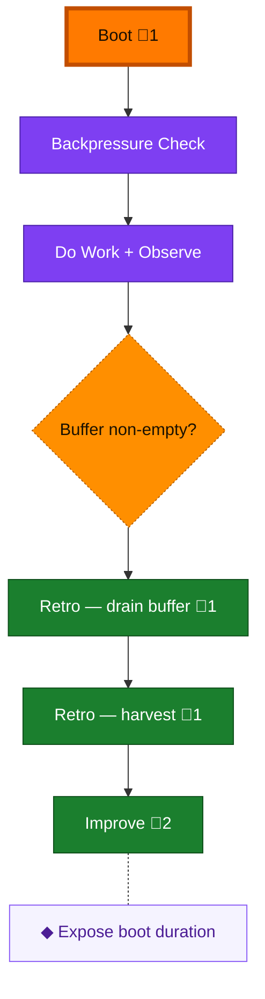

<!-- GENERATED by `harness flow render` — do not hand-edit; regenerate from the flow JSON. -->
# Flow · loop

**Kind**: harness-loop · **Now**: boot · **Intent**: Begin the next engineering session with pre-flight evidence · **Nodes**: 8 · **Events**: 19

**Rail**: ◆─◇─[ ◇─◇ ]─◆─◆─◆  ◆ Boot · ◇ Backpressure Check · [ ◇ Do Work + Observe · ◇ Buffer non-empty? ] · ◆ Retro — drain buffer · ◆ Retro — harvest · ◆ Improve

**Legend** — colour = type/status: 🟩 done · 🟢 in-progress · 🟥 blocked · 🟦 known · ⬜ assumed · 🔶 decision · 🗣 user input · 🟪 harness chore (faded = not yet done) · 🤖 companion · 🛠 worker · 🟧 current (you are here). Badges: 💬 comments · 📄 artifacts · 📝 instructions · 🧰 chore (° optional / recommended / ‼ strongly-recommended; ✓ done · ✕ skipped).

## Node log

### boot · Boot
- `2026-08-08T07:47:54.029Z` · agent · validation — decision:route verdict:HEALTHY reason:harness-boot-ok-interact-and-evidence-readable duration_seconds:22 time:2026-08-08T07:47:38Z

### retro-drain · Retro — drain buffer
- `2026-08-08T07:49:48.224Z` · agent · validation — decision:route verdict:saved-all record:.harness/records/retro/2026-08-08/001-adoption-session.md observations:2 time:2026-08-08T07:49:16Z

### retro-harvest · Retro — harvest
- `2026-08-08T07:54:11.945Z` · agent · validation — decision:route verdict:harvested records:1 entries:2 open:2 highest_value:SUGG-001 time:2026-08-08T07:53:56Z

### improve · Improve
- `2026-08-08T07:56:15.173Z` · agent · validation — decision:encoded verdict:ok improvement:boot-duration maturity:L3 time:2026-08-08T07:55:52Z
- `2026-08-08T07:58:57.122Z` · agent · validation — decision:upstream-needed verdict:recorded record:.harness/records/retro/2026-08-08/002-improve-excursion-schema.md time:2026-08-08T07:58:32Z

### improve-boot-duration · Expose boot duration
- `2026-08-08T07:56:14.023Z` · agent · validation — decision:encoded verdict:ok evidence:harness-boot-duration_ms-22158 record:.harness/records/harness-change/2026-08-08/002-boot-duration.md time:2026-08-08T07:55:38Z
