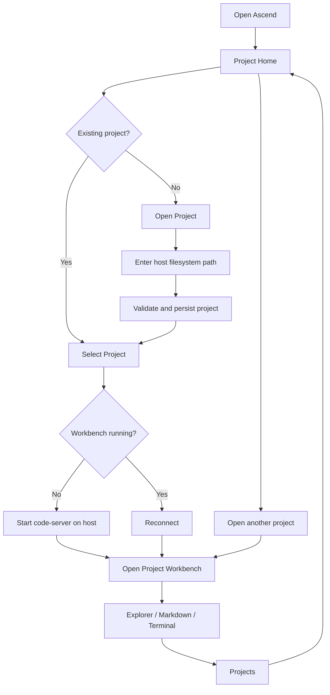

# Ascend MVP — Project Home and Persistent Host Workbenches

> **PRD-ASCEND-MVP-001** | Status: draft | Version: 0.1.0 | Last Updated: 2026-08-08

---

## Executive Summary

Ascend is a browser-based home for development projects that already exist on the filesystem of the machine running Ascend.

The MVP is intentionally small.

Ascend provides a landing page containing a curated set of projects explicitly opened by the user. Selecting a project opens a persistent browser-hosted VS Code workbench, initially provided by `code-server`.

Ascend does not attempt to rebuild an IDE.

The hosted VS Code workbench provides the project-level experience that matters most:

- filesystem explorer
- Markdown preview
- image and file previews
- integrated terminal
- Git tooling
- editor tabs and layout
- extensions
- source editing when required

The integrated terminal is a critical product requirement.

The terminal MUST execute on the same host machine where Ascend is running and SHOULD behave equivalently to opening a terminal directly on that machine as the configured Ascend user.

This means existing developer tools such as:

- Git
- GitHub CLI
- Copilot CLI
- Docker
- tmux
- SSH
- Node.js
- Python
- project-specific tooling

must be available according to the host user's normal environment.

The primary MVP hypothesis is:

> A simple project dashboard plus persistent host-native VS Code workbenches provides a better experience for moving between multiple development projects than multiple editor windows, browser tabs, or rebuilding Explorer, Terminal, Preview, and related IDE features inside Ascend.

The MVP is successful when a user can open several filesystem projects, enter any project, work primarily through its terminal and VS Code workbench, return to the Ascend dashboard, enter another project, and later resume the first project with its previous workbench and terminal state intact.

---

# Product Context

## Problem

A developer working across several repositories or Git worktrees commonly ends up managing:

- multiple VS Code windows
- multiple browser tabs
- separate terminal windows
- several long-running CLI processes
- different project contexts

Existing DevDeck prototypes demonstrated the value of having a central project surface, but also exposed the cost of reproducing mature IDE capabilities such as:

- file exploration
- terminals
- Markdown rendering
- file previews
- tab management
- Git integration
- keyboard behaviour

VS Code already implements these capabilities well.

Ascend should therefore own the navigation **between projects**, while VS Code owns the experience **inside a project**.

## Product Vision

Ascend should feel like an ExcaliDash-style landing page for development projects:

```text
ASCEND

+ Open Project

┌─────────────────┐
│ ascend          │
│ ~/code/ascend   │
│                 │
│ Open →          │
└─────────────────┘

┌─────────────────┐
│ soft-factory    │
│ ~/code/soft...  │
│                 │
│ Open →          │
└─────────────────┘

┌─────────────────┐
│ toolio          │
│ ~/code/toolio   │
│                 │
│ Open →          │
└─────────────────┘
```

Opening a card enters the project workbench:

```text
┌──────────────────────────────────────────────────────────────┐
│ ← Projects                   soft-factory                    │
├──────────────────────────────────────────────────────────────┤
│                                                              │
│                      VS Code Workbench                       │
│                                                              │
│ Explorer │ Markdown / Files                                  │
│          │                                                   │
│──────────┴───────────────────────────────────────────────────│
│ Terminal                                                     │
│                                                              │
│ $ copilot --yolo ...                                         │
│                                                              │
└──────────────────────────────────────────────────────────────┘
```

The user can always return using:

```text
← Projects
```

Ascend does not need a permanent project sidebar around the workbench for MVP.

The dashboard is the project switcher.

---

# Users and Personas

## Primary Persona: Host Developer

**Role**

Developer using one machine as their primary development environment, potentially accessing it remotely through a browser.

**Jobs to be done**

- Open development projects quickly.
- Move among several active projects.
- Use the actual development environment installed on the host.
- Keep long-running terminal sessions alive while working elsewhere.
- Return to previous project context without reconstructing it.
- Access projects from another browser-capable device.

**Pain points**

- Too many VS Code windows.
- Too many browser tabs.
- Difficulty remembering where work is running.
- Repeated terminal setup.
- Rebuilding functionality already present in VS Code.
- Remote devices not having the same development tooling as the host.

**Success outcome**

The user opens Ascend first, chooses a project, and receives the same effective terminal environment and familiar VS Code project experience as if they were sitting directly at the development machine.

---

# Design Decisions

### DD-001 — Ascend owns project navigation, not IDE functionality

Ascend SHALL provide the project dashboard, lifecycle, and cross-project navigation.

VS Code/code-server SHALL provide filesystem navigation, terminal, previews, source editing, Git UI, and extensions.

---

### DD-002 — Projects are explicitly opened

Ascend SHALL NOT scan the host filesystem and automatically register repositories.

A user explicitly opens a project by supplying or selecting its filesystem path.

---

### DD-003 — Project files remain where they already exist

Ascend SHALL reference existing directories.

Opening a project SHALL NOT:

- clone
- copy
- move
- rename
- import

the project.

---

### DD-004 — Closing is not deleting

Closing a project SHALL remove it from Ascend and stop Ascend-managed runtime resources.

Closing SHALL NOT delete or modify the underlying project directory.

---

### DD-005 — code-server is the initial workbench

The MVP SHALL use `code-server` as the browser-hosted VS Code provider.

This is an MVP implementation decision rather than a permanent requirement for all future Ascend versions.

---

### DD-006 — code-server runs directly on the host

For the MVP, code-server processes SHALL run directly on the Ascend host rather than inside per-project containers.

The reason is to preserve the host development environment, especially the terminal experience.

---

### DD-007 — The terminal is host-native

The VS Code integrated terminal SHALL execute on the Ascend host under the same configured OS user as the workbench.

The terminal is a primary product capability rather than an incidental editor feature.

---

### DD-008 — One workbench runtime per active project

The MVP SHALL initially test one independent code-server runtime per running project so each project can preserve independent:

- terminals
- tabs
- layout
- Git context
- workspace state

This decision SHALL be validated against resource usage during MVP development.

---

### DD-009 — Ascend uses two primary surfaces

The MVP SHALL contain:

1. Project Home
2. Project Workbench

Additional navigation surfaces are deferred.

---

### DD-010 — Technology stack

The initial implementation SHOULD use:

```text
Frontend
- React
- Vite
- TypeScript
- Tailwind CSS
- shadcn/ui

Backend
- Node.js
- Fastify
- TypeScript

Persistence
- SQLite
- Drizzle ORM

Workbench
- code-server

Runtime
- host child processes

Testing
- Vitest
- Playwright

Package management
- pnpm
```

Next.js, Docker-based workbench isolation, Kubernetes, Redis, and PostgreSQL are not required for the MVP.

---

# Product Goals

## GOAL-001 — Central Project Entry Point

Provide one browser-based home from which the user can open and access their explicitly selected development projects.

**Priority:** MUST

**KPI:** 100% of registered projects can be entered from the Ascend dashboard without manually opening another editor window or entering a runtime port.

---

## GOAL-002 — Host-Native Terminal Experience

Provide a browser terminal whose effective environment matches the development host closely enough that the user's normal development workflows can be performed through it.

**Priority:** MUST

**KPI:** Required host CLI verification commands execute successfully from the project terminal.

Minimum verification set:

```text
pwd
git --version
git status
gh --version
docker --version or configured equivalent
tmux -V
```

Copilot CLI SHOULD also be verified when installed on the host.

---

## GOAL-003 — Persistent Multi-Project Context

Allow users to leave one project, work in another, and return without losing the previous project's active terminal and editor context.

**Priority:** MUST

**KPI:** A three-project switching scenario completes without losing active terminal sessions or restoring the wrong project state.

---

# Functional Requirements

## FR-001 — Display Project Home

**Actor:** Developer
**Trigger:** User opens Ascend.
**Expected Outcome:** Ascend displays the curated list of currently registered projects.

Each project SHALL display at minimum:

- project display name
- filesystem path
- Open action

**Acceptance Criteria:** AC-001
**Product Goals:** GOAL-001

---

## FR-002 — Open Project by Filesystem Path

**Actor:** Developer
**Trigger:** User chooses `Open Project`.
**Expected Outcome:** User can provide an existing directory path on the Ascend host and register it as a project.

Ascend SHALL:

1. accept a filesystem path
2. expand supported user-home notation
3. canonicalise the path
4. verify that it exists
5. verify that it is a directory
6. verify that it is readable
7. prevent duplicate canonical paths
8. persist the project

The project MAY be a Git repository but Git SHALL NOT be required.

**Acceptance Criteria:** AC-002, AC-003, AC-004
**Product Goals:** GOAL-001

---

## FR-003 — Persist Project Library

**Actor:** System
**Trigger:** Ascend restarts.
**Expected Outcome:** Previously opened projects remain visible.

Persistence SHALL store metadata only.

Ascend SHALL NOT copy project contents into its own storage.

**Acceptance Criteria:** AC-005
**Product Goals:** GOAL-001

---

## FR-004 — Enter Project Workbench

**Actor:** Developer
**Trigger:** User selects a project card.
**Expected Outcome:** Ascend opens that project's browser-hosted VS Code workbench.

If the workbench runtime does not exist, Ascend SHALL start it.

If it is already running, Ascend SHALL reconnect to it.

**Acceptance Criteria:** AC-006, AC-007
**Product Goals:** GOAL-001, GOAL-003

---

## FR-005 — Open Correct Filesystem Folder

**Actor:** System
**Trigger:** A project's code-server runtime starts.
**Expected Outcome:** The VS Code workspace SHALL open the exact canonical project directory registered in Ascend.

**Acceptance Criteria:** AC-008
**Product Goals:** GOAL-001

---

## FR-006 — Provide VS Code Explorer

**Actor:** Developer
**Trigger:** Project workbench loads.
**Expected Outcome:** The user can browse project files using VS Code's native Explorer.

Ascend SHALL NOT implement a second project file explorer.

**Acceptance Criteria:** AC-009
**Product Goals:** GOAL-001

---

## FR-007 — Provide Markdown Preview

**Actor:** Developer
**Trigger:** User opens a Markdown document and invokes preview.
**Expected Outcome:** VS Code's Markdown preview renders the selected Markdown document.

Ascend SHALL NOT implement its own Markdown preview for the MVP.

**Acceptance Criteria:** AC-010
**Product Goals:** GOAL-001

---

## FR-008 — Provide Host-Native Integrated Terminal

**Actor:** Developer
**Trigger:** User opens a VS Code integrated terminal.
**Expected Outcome:** The terminal executes on the Ascend host using the configured host user.

The terminal's initial working directory SHALL be the selected project directory.

**Acceptance Criteria:** AC-011, AC-012, AC-013
**Product Goals:** GOAL-002

---

## FR-009 — Preserve Host Development Tooling

**Actor:** Developer
**Trigger:** Developer invokes an installed host CLI tool from the integrated terminal.
**Expected Outcome:** The tool behaves substantially as it does from a normal interactive terminal for the same OS user.

This includes, where installed/configured:

- Git
- GitHub CLI
- Copilot CLI
- Docker CLI
- tmux
- SSH
- Node.js
- Python
- package managers

**Acceptance Criteria:** AC-014
**Product Goals:** GOAL-002

---

## FR-010 — Return to Project Home

**Actor:** Developer
**Trigger:** User selects `Projects` or equivalent back-navigation from the project workbench.
**Expected Outcome:** Ascend returns to Project Home without closing the project's workbench runtime.

**Acceptance Criteria:** AC-015
**Product Goals:** GOAL-001, GOAL-003

---

## FR-011 — Maintain Project Workbench While Away

**Actor:** System
**Trigger:** User navigates away from a project to Project Home or another project.
**Expected Outcome:** The project's running workbench and terminal sessions SHALL continue unless explicitly stopped or the runtime fails.

**Acceptance Criteria:** AC-016
**Product Goals:** GOAL-003

---

## FR-012 — Independent Project Sessions

**Actor:** Developer
**Trigger:** User opens multiple projects.
**Expected Outcome:** Each running project SHALL have an independent workbench session.

A terminal or editor state in Project A SHALL NOT appear in Project B.

**Acceptance Criteria:** AC-017
**Product Goals:** GOAL-003

---

## FR-013 — Resume Project Session

**Actor:** Developer
**Trigger:** User returns to a previously running project.
**Expected Outcome:** The previous VS Code state SHALL still be available, including active terminal sessions when the code-server process remained running.

**Acceptance Criteria:** AC-018
**Product Goals:** GOAL-003

---

## FR-014 — Close Project

**Actor:** Developer
**Trigger:** User selects `Close Project`.
**Expected Outcome:** Ascend removes the project from Project Home and stops its Ascend-managed workbench runtime.

Closing the project SHALL NOT delete or modify the project directory.

**Acceptance Criteria:** AC-019, AC-020
**Product Goals:** GOAL-001

---

## FR-015 — Stop Project Workbench

**Actor:** Developer
**Trigger:** User selects `Stop Workbench`.
**Expected Outcome:** Ascend stops the code-server runtime while retaining the project in the Project Home.

**Acceptance Criteria:** AC-021
**Product Goals:** GOAL-001

---

## FR-016 — Restart Project Workbench

**Actor:** Developer
**Trigger:** User selects `Restart Workbench` or retries a failed runtime.
**Expected Outcome:** Ascend stops any existing project runtime and launches a replacement against the same filesystem directory.

**Acceptance Criteria:** AC-022
**Product Goals:** GOAL-001

---

## FR-017 — Workbench Runtime Status

**Actor:** Developer
**Trigger:** Project runtime changes state.
**Expected Outcome:** Ascend SHALL expose at least:

```text
Stopped
Starting
Running
Failed
```

**Acceptance Criteria:** AC-023
**Product Goals:** GOAL-001

---

## FR-018 — Stable Workbench Routing

**Actor:** Developer
**Trigger:** Browser connects to a project workbench.
**Expected Outcome:** Ascend SHALL provide a stable project route without requiring the user to know the code-server port.

Example:

```text
/projects/{projectId}/workbench/
```

Internal ports SHALL NOT appear in normal user navigation.

**Acceptance Criteria:** AC-024
**Product Goals:** GOAL-001

---

# Non-Functional Requirements

## Performance and Capacity

### NFR-001 — Warm Project Navigation

When a project runtime is already running, Ascend SHOULD display or reconnect to its workbench within 2 seconds under normal local-network conditions.

---

### NFR-002 — Cold Project Startup

When starting a stopped project, the workbench SHOULD become usable within 15 seconds on the target development host.

The implementation SHALL measure actual startup time before treating this target as a release gate.

---

### NFR-003 — Initial Concurrent Project Capacity

Ascend SHALL support at least 3 simultaneously running workbench sessions on the target host.

Resource behaviour for 5 and 10 concurrent sessions SHOULD be measured before later lifecycle policies are designed.

---

## Reliability and Resilience

### NFR-004 — Runtime Isolation

Failure of one project's code-server process SHALL NOT terminate or corrupt another project's workbench runtime.

---

### NFR-005 — Safe Runtime Restart

Restarting a project runtime SHALL NOT modify project files except changes explicitly made by processes operating inside the project.

---

### NFR-006 — Backend Recovery

After an Ascend server restart, the persisted project library SHALL remain available.

Ascend SHALL reconcile recorded runtime state with actual running processes rather than assuming persisted runtime state is correct.

---

## Security

### NFR-007 — Loopback Runtime Binding

Individual code-server processes SHOULD bind only to a loopback interface unless explicitly configured otherwise.

Ascend SHALL mediate browser access through the intended workbench route.

---

### NFR-008 — Filesystem Path Validation

Ascend SHALL canonicalise and validate project paths before launching a workbench.

Server-side filesystem operations SHALL reject path traversal outside the permitted project-opening policy.

---

### NFR-009 — User Permissions

A workbench SHALL execute with no greater host filesystem permissions than the configured Ascend OS user.

Ascend SHALL NOT require root privileges for normal operation.

---

## Privacy

### NFR-010 — No Source Content Telemetry

Ascend SHALL NOT collect or persist:

- source file contents
- terminal contents
- command output
- clipboard contents
- prompts
- secrets

as product telemetry.

---

## Scalability and Elasticity

### NFR-011 — Lazy Runtime Startup

Registering a project SHALL NOT require its workbench runtime to remain permanently running.

Runtime startup MAY occur when the user opens the project.

Automatic sleeping is deferred beyond MVP.

---

## Maintainability and Operability

### NFR-012 — Editor Responsibility Boundary

Ascend SHALL NOT contain custom implementations of:

- source editor
- terminal emulator
- project file explorer
- Markdown renderer
- Git diff viewer

for the MVP.

---

### NFR-013 — Runtime Encapsulation

Process lifecycle logic SHALL be isolated behind a small internal runtime-management boundary so process execution is not distributed throughout UI or route code.

---

### NFR-014 — Simple Local Operation

A developer SHOULD be able to start the complete Ascend MVP using one documented command after dependencies are installed.

Example target:

```bash
pnpm dev
```

---

## Observability

### NFR-015 — Runtime Events

Ascend SHALL produce structured logs for:

```text
project.open.requested
project.open.succeeded
project.open.failed

project.closed
project.activated

runtime.start.requested
runtime.start.succeeded
runtime.start.failed

runtime.stop.requested
runtime.stop.succeeded

runtime.restart.requested
runtime.restart.succeeded
runtime.restart.failed

runtime.health.changed
```

---

### NFR-016 — Startup Measurements

Runtime startup logs SHALL include sufficient timing information to measure code-server startup duration.

---

## Usability and Accessibility

### NFR-017 — Two-Surface Navigation

The MVP SHALL make the distinction between:

```text
Projects
Workbench
```

clear without requiring documentation.

---

### NFR-018 — Safe Close Language

The Close Project interface SHALL explicitly communicate that closing removes the project from Ascend but does not delete the filesystem directory.

---

### NFR-019 — Browser Usability

The primary workflows SHALL be usable from a modern Chromium-based desktop browser.

Tablet usability SHOULD be manually evaluated during MVP validation.

---

## Compatibility and Interoperability

### NFR-020 — Terminal Environment Compatibility

The integrated terminal SHALL inherit or construct an environment sufficient for the configured OS user's normal development tools to resolve correctly.

Differences between login-shell and non-login-shell environment initialization SHALL be documented and addressed when they prevent required host tooling from working.

---

### NFR-021 — WebSocket Support

Ascend's workbench routing SHALL support WebSocket traffic required by code-server and the integrated terminal.

---

## Portability

### NFR-022 — Initial Host Platform

The MVP SHALL target the host operating system selected for initial development.

Cross-platform support SHALL NOT block MVP validation.

Platform-specific assumptions SHALL be documented.

---

# Constraints

## CON-001 — Existing Filesystem Projects

Projects already exist on the host filesystem.

**Category:** Technical
**Non-negotiability:** Ascend must operate on those existing directories rather than copying them into an Ascend-managed workspace.

---

## CON-002 — Host-Native Terminal

The project terminal must execute on the Ascend host.

**Category:** Product / Technical
**Non-negotiability:** Host-terminal parity is a primary product requirement.

---

## CON-003 — No Per-Project Container Requirement

The MVP must not require code-server to run inside a container.

**Category:** Technical
**Reason:** Container isolation would complicate parity with the host's developer environment.

---

## CON-004 — User-Selected Project Library

Ascend must not automatically index all repositories on the host.

**Category:** Product
**Reason:** The user explicitly controls which projects appear in Ascend.

---

## CON-005 — Close Is Non-Destructive

Closing a project must never delete project files.

**Category:** Safety
**Non-negotiability:** Ascend does not own project contents.

---

## CON-006 — code-server Initial Provider

The MVP uses code-server for its hosted VS Code workbench.

**Category:** Technical
**Reason:** The purpose of the MVP is to validate the product experience using mature VS Code capabilities rather than rebuilding them.

---

# Process Models



---

# Acceptance Criteria

## AC-001 — Project Home

**Given** Ascend contains registered projects
**When** the user opens the Ascend root page
**Then** every registered project is displayed with its name, filesystem path, and Open action.

**Covers:** FR-001
**Status:** Not Started

---

## AC-002 — Open Valid Project

**Given** `/home/user/code/project-a` exists and is readable
**When** the user opens that path in Ascend
**Then** Ascend registers exactly one project representing that canonical directory.

**Covers:** FR-002
**Status:** Not Started

---

## AC-003 — Reject Invalid Path

**Given** the supplied path does not exist or is not a directory
**When** the user attempts to open it
**Then** Ascend rejects the request and shows an actionable validation error.

**Covers:** FR-002
**Status:** Not Started

---

## AC-004 — Prevent Duplicate Project

**Given** a canonical filesystem path is already registered
**When** the user attempts to open the same path using an equivalent path expression
**Then** Ascend activates the existing project rather than creating a duplicate.

**Covers:** FR-002
**Status:** Not Started

---

## AC-005 — Persist Project Library

**Given** multiple projects are registered
**When** Ascend is stopped and restarted
**Then** those projects reappear without requiring the user to open them again.

**Covers:** FR-003
**Status:** Not Started

---

## AC-006 — Start Project Workbench

**Given** a registered project has no running workbench
**When** the user selects Open
**Then** Ascend starts a code-server process against that project's canonical filesystem path.

**Covers:** FR-004
**Status:** Not Started

---

## AC-007 — Reuse Running Workbench

**Given** a project's code-server process is already healthy
**When** the user opens the project again
**Then** Ascend reconnects to that existing workbench rather than creating another runtime.

**Covers:** FR-004
**Status:** Not Started

---

## AC-008 — Correct Project Directory

**Given** Project A maps to `/home/user/code/a`
**When** its workbench starts
**Then** VS Code opens `/home/user/code/a` as the workspace folder.

**Covers:** FR-005
**Status:** Not Started

---

## AC-009 — Explorer Available

**Given** a project workbench has loaded
**When** the user opens VS Code Explorer
**Then** files from the selected host project are visible.

**Covers:** FR-006
**Status:** Not Started

---

## AC-010 — Markdown Preview Available

**Given** a project contains a valid Markdown file
**When** the user opens VS Code Markdown Preview
**Then** the Markdown content is rendered using the VS Code workbench.

**Covers:** FR-007
**Status:** Not Started

---

## AC-011 — Terminal Runs on Host

**Given** a project workbench is running
**When** the user opens an integrated terminal and executes:

```bash
hostname
```

**Then** the command identifies the Ascend host according to normal host configuration.

**Covers:** FR-008
**Status:** Not Started

---

## AC-012 — Terminal Starts in Project

**Given** Project A represents `/home/user/code/a`
**When** the user opens a new integrated terminal
**Then**:

```bash
pwd
```

reports the project working directory or its platform-equivalent canonical location.

**Covers:** FR-008
**Status:** Not Started

---

## AC-013 — Terminal Uses Configured Host User

**Given** Ascend runs workbenches under a configured OS user
**When** the user executes the platform-equivalent identity command
**Then** the terminal reports that configured user rather than an isolated container-only identity.

**Covers:** FR-008
**Status:** Not Started

---

## AC-014 — Development Tools Available

**Given** Git, GitHub CLI, Docker CLI, tmux, and other required tooling are installed and available to the Ascend host user
**When** the corresponding commands are executed from the integrated terminal
**Then** they are resolvable and usable without installing duplicate tooling inside a per-project Ascend container.

**Covers:** FR-009
**Status:** Not Started

---

## AC-015 — Return Home

**Given** the user is inside a project workbench
**When** the user selects `Projects`
**Then** Ascend returns to Project Home without intentionally stopping that project's runtime.

**Covers:** FR-010
**Status:** Not Started

---

## AC-016 — Long-Running Terminal Continues

**Given** a long-running command is active in Project A's terminal
**When** the user returns to Project Home and opens Project B
**Then** Project A's process continues while its workbench runtime remains running.

**Covers:** FR-011
**Status:** Not Started

---

## AC-017 — Independent Sessions

**Given** Project A and Project B both have running workbenches
**When** different terminals and files are opened in each
**Then** each project's VS Code and terminal state remains independent.

**Covers:** FR-012
**Status:** Not Started

---

## AC-018 — Resume Previous State

**Given** Project A has an active terminal session and open workbench state
**And** the user navigates to Project B
**When** the user later returns to Project A
**Then** the previous terminal and editor state are still present while the original runtime remained running.

**Covers:** FR-013
**Status:** Not Started

---

## AC-019 — Close Removes Project

**Given** Project A is registered in Ascend
**When** the user confirms Close Project
**Then** Project A is removed from Project Home.

**Covers:** FR-014
**Status:** Not Started

---

## AC-020 — Close Does Not Delete Files

**Given** Project A exists at `/home/user/code/a`
**When** Project A is closed in Ascend
**Then** `/home/user/code/a` and its contents remain unchanged by the close operation.

**Covers:** FR-014
**Status:** Not Started

---

## AC-021 — Stop Workbench

**Given** a project is registered and running
**When** the user stops its workbench
**Then** the runtime stops and the project remains registered.

**Covers:** FR-015
**Status:** Not Started

---

## AC-022 — Restart Workbench

**Given** a project workbench is running or failed
**When** the user requests Restart
**Then** Ascend launches one healthy replacement workbench against the same project path.

**Covers:** FR-016
**Status:** Not Started

---

## AC-023 — Runtime State

**Given** a registered project
**When** its workbench transitions through its lifecycle
**Then** Ascend exposes an accurate state from:

```text
Stopped
Starting
Running
Failed
```

**Covers:** FR-017
**Status:** Not Started

---

## AC-024 — Stable Workbench Route

**Given** an internal code-server process uses an ephemeral or allocated port
**When** the user opens its project
**Then** normal browser navigation uses an Ascend-owned project route and does not require manual port entry.

**Covers:** FR-018
**Status:** Not Started

---

# Traceability Matrix

## FR-to-AC Coverage

| Requirement | Acceptance Criteria | Covered |
|---|---|---|
| FR-001 | AC-001 | Yes |
| FR-002 | AC-002, AC-003, AC-004 | Yes |
| FR-003 | AC-005 | Yes |
| FR-004 | AC-006, AC-007 | Yes |
| FR-005 | AC-008 | Yes |
| FR-006 | AC-009 | Yes |
| FR-007 | AC-010 | Yes |
| FR-008 | AC-011, AC-012, AC-013 | Yes |
| FR-009 | AC-014 | Yes |
| FR-010 | AC-015 | Yes |
| FR-011 | AC-016 | Yes |
| FR-012 | AC-017 | Yes |
| FR-013 | AC-018 | Yes |
| FR-014 | AC-019, AC-020 | Yes |
| FR-015 | AC-021 | Yes |
| FR-016 | AC-022 | Yes |
| FR-017 | AC-023 | Yes |
| FR-018 | AC-024 | Yes |

**Coverage:** 100%

---

## FR-to-GOAL Alignment

| Requirement | Product Goal |
|---|---|
| FR-001 | GOAL-001 |
| FR-002 | GOAL-001 |
| FR-003 | GOAL-001 |
| FR-004 | GOAL-001, GOAL-003 |
| FR-005 | GOAL-001 |
| FR-006 | GOAL-001 |
| FR-007 | GOAL-001 |
| FR-008 | GOAL-002 |
| FR-009 | GOAL-002 |
| FR-010 | GOAL-001, GOAL-003 |
| FR-011 | GOAL-003 |
| FR-012 | GOAL-003 |
| FR-013 | GOAL-003 |
| FR-014 | GOAL-001 |
| FR-015 | GOAL-001 |
| FR-016 | GOAL-001 |
| FR-017 | GOAL-001 |
| FR-018 | GOAL-001 |

**Coverage:** 100%

---

# MVP and Release Framing

## MVP Definition

The MVP proves one workflow:

```text
Project Home
     ↓
Open filesystem project
     ↓
Enter persistent host-native VS Code workbench
     ↓
Use Explorer / Markdown / Terminal
     ↓
Return to Projects
     ↓
Enter another project
     ↓
Return to first project
     ↓
Resume previous terminal/workbench state
```

## MVP MUST Include

- FR-001 Project Home
- FR-002 Open Project by path
- FR-003 Project persistence
- FR-004 Enter workbench
- FR-005 Correct project folder
- FR-006 VS Code Explorer
- FR-007 Markdown preview
- FR-008 Host-native terminal
- FR-009 Host development tools
- FR-010 Return to Projects
- FR-011 Runtime stays alive while away
- FR-012 Independent sessions
- FR-013 Session resume
- FR-014 Close Project
- FR-015 Stop Workbench
- FR-016 Restart Workbench
- FR-017 Runtime status
- FR-018 Stable workbench route

## Explicitly Deferred

The MVP SHALL NOT include:

- custom source-code editor
- custom file explorer
- custom terminal
- custom Markdown renderer
- automatic repository scanning
- first-class Git worktree creation
- issue integration
- agent dashboards
- RPIV orchestration
- application-preview manager
- OpenTelemetry export
- idle sleep
- multi-machine runtimes
- multi-user collaboration
- Kubernetes
- cloud-hosted workspaces
- plugin marketplace
- multiple editor providers
- Docker isolation for workbench runtimes

These features require separate validation after the core experience succeeds.

---

# Suggested MVP Delivery Slices

The PRD intentionally supports incremental story generation.

## Slice 1 — Prove Host Workbench

Objective:

Prove that code-server can run directly against an existing filesystem folder while providing the required terminal environment.

Demonstration:

```text
Start code-server against project A
→ open Explorer
→ render README.md
→ open terminal
→ run host developer commands
```

The terminal requirement MUST be proven before proceeding.

---

## Slice 2 — Ascend Project Home

Objective:

Create the landing-page experience.

Capabilities:

```text
Ascend
+ Open Project
Project cards
Persist project list
Close Project
```

No multi-project runtime orchestration is required yet.

---

## Slice 3 — Project Workbench Navigation

Objective:

Connect the landing page to one code-server workbench.

Flow:

```text
Project Home
→ Open Project
→ Workbench
→ Projects
→ Project Home
```

This slice SHALL determine whether:

- embedded workbench
- full-page workbench with Ascend header

provides the better user experience.

---

## Slice 4 — Multiple Persistent Workbenches

Objective:

Run independent workbench sessions for at least three projects.

Critical validation:

```text
Project A
→ start terminal process

Project B
→ start different terminal process

Project C
→ inspect project

Return to A
→ original process/session still present
```

---

## Slice 5 — Lifecycle and Hardening

Objective:

Provide:

- Start
- Stop
- Restart
- Failed state
- health detection
- runtime reconciliation
- stable proxy routes

This slice turns the prototype into the MVP.

---

# Success Metrics

## Metric 1 — Host Terminal Compatibility

**Linked Goal:** GOAL-002

**Definition**

Percentage of required host development commands successfully executable from the Ascend workbench terminal.

**Baseline**

Not measured.

**Target**

100% of the defined MVP host-tool verification set.

**Measurement**

Manual and automated integration validation against the target development host.

---

## Metric 2 — Project Session Preservation

**Linked Goal:** GOAL-003

**Definition**

Percentage of project-switching validation runs in which terminal and editor context remain associated with the correct project.

**Target**

100% for MVP acceptance tests.

---

## Metric 3 — Warm Project Switch

**Linked Goal:** GOAL-003

**Definition**

Elapsed time from selecting an already-running project until its workbench is usable.

**Target**

≤ 2 seconds under normal target conditions.

---

## Metric 4 — Cold Workbench Startup

**Linked Goal:** GOAL-001

**Definition**

Elapsed time from opening a stopped project until the workbench is usable.

**Initial target**

≤ 15 seconds.

The target SHALL be reassessed after empirical prototype measurements.

---

## Metric 5 — Safe Close

**Linked Goal:** GOAL-001

**Definition**

Number of filesystem modifications caused solely by Close Project.

**Target**

0.

---

# Risks and Assumptions

## Key Assumptions

### A-001 — code-server provides the required VS Code subset

Assumption:

Explorer, Markdown preview, integrated terminal, Git functionality, and relevant extensions behave adequately in code-server.

**Impact if false:** High

**Mitigation:**

Validate this in the first delivery slice before investing in the broader UI.

---

### A-002 — Host-process workbenches provide terminal parity

Assumption:

Running code-server as the host user provides sufficiently equivalent terminal behaviour to a directly opened host terminal.

**Impact if false:** High

**Mitigation:**

Make shell initialization and PATH behaviour an explicit early validation target.

---

### A-003 — Multiple code-server processes are affordable

Assumption:

The target host can run several independent code-server instances simultaneously.

**Impact if false:** Medium/High

**Mitigation:**

Measure 3, 5, and 10 instances. Introduce manual stop or later sleeping if necessary.

---

### A-004 — Browser-hosted VS Code is usable on intended clients

Assumption:

The desired browsers provide acceptable keyboard, clipboard, terminal, and WebSocket behaviour.

**Impact if false:** High

**Mitigation:**

Perform early manual validation on the intended desktop and tablet clients.

---

# Risk Register

| Risk | Probability | Impact | Mitigation |
|---|---|---|---|
| code-server iframe behaviour is poor | Medium | High | Test embedded and full-page modes; do not make iframe mandatory |
| Integrated terminal does not inherit expected host PATH | Medium | High | Explicitly control/document shell environment and validate required tools |
| Several workbench processes consume excessive memory | Medium | Medium | Measure early; add manual stop first, sleeping later |
| Reverse proxy breaks WebSockets or editor webviews | Medium | High | Prototype proxy routing before polishing UI |
| Project close accidentally becomes destructive | Low | Critical | No filesystem-delete path in Close Project implementation; automated safety tests |
| Browser refresh loses Ascend navigation context | Medium | Medium | Stable project URLs and persisted active-project metadata |
| Workbench runtime dies while terminal process matters | Medium | High | Expose failure clearly; investigate persistence/terminal strategy after MVP evidence |
| Ascend grows into another IDE | Medium | High | Enforce DD-001 and NFR-012 during story review |

---

# Glossary

### Ascend

The project dashboard and workbench launcher described by this PRD.

### Project

An existing filesystem directory explicitly registered in Ascend.

### Project Home

The Ascend landing page containing project cards and Open Project.

### Workbench

The browser-hosted VS Code environment for one project.

### code-server

The initial VS Code-compatible server used to provide the workbench.

### Host

The machine running Ascend and containing the development projects.

### Host-Native Terminal

A terminal executing on the Ascend host under the configured development user rather than inside an Ascend-managed per-project container.

### Open Project

Register an existing filesystem directory with Ascend.

### Close Project

Remove a project from Ascend and stop Ascend-managed runtime resources without modifying the project directory.

### Stop Workbench

Stop the project's code-server runtime while leaving the project registered in Ascend.

---

# Sign-Off

## Approval Checklist

- Product Owner: TBD
- Technical Lead: TBD
- Quality Lead: TBD

Approval date: TBD

## Waivers

None.

## Handoff Readiness

This PRD is ready for story decomposition when:

- [ ] Product Owner approves the MVP scope.
- [ ] Technical Lead confirms host-process code-server is an acceptable Prototype 1 direction.
- [ ] GOAL → FR coverage remains 100%.
- [ ] FR → AC coverage remains 100%.
- [ ] All MVP functional requirements have explicit acceptance criteria.
- [ ] Terminal host-parity requirements are retained as MUST requirements.
- [ ] Deferred functionality has not been introduced into the MVP backlog.

The decomposition agent SHOULD create issues by delivery slice rather than generating all future Ascend functionality.

Each story SHOULD:

1. map to one or more `FR-###` requirements
2. identify applicable `NFR-###` requirements
3. include linked `AC-###` criteria
4. be independently demonstrable
5. avoid implementing deferred functionality
6. preserve the IDE-versus-Ascend product boundary

---

# Recommended Story Generation Instruction

Use this PRD to generate an implementation backlog for **Ascend MVP only**.

Generate stories grouped into the five delivery slices defined under **Suggested MVP Delivery Slices**.

For every story:

- link the relevant `FR-###`
- link the relevant `AC-###`
- link applicable `NFR-###`
- define explicit scope
- define explicit out-of-scope
- include implementation acceptance criteria
- include automated or manual validation steps
- include a demo procedure
- identify dependencies
- identify risks

Prefer small stories that validate product assumptions early.

Do not generate stories for deferred capabilities.

The highest-risk requirement is the host-native terminal experience. Prioritize validating `FR-008` and `FR-009` before significant investment in dashboard polish or runtime orchestration.

The second highest-risk area is whether code-server can be presented within the Ascend experience without compromising keyboard, terminal, WebSocket, extension, or preview behaviour.

Treat those as validation gates rather than assumptions.

---

# Document Metadata

- Template family: Microsoft HVE Core PRD
- PRD lifecycle target: Assess → Discover → Create → Build → Integrate → Validate → Finalize
- Document status: Draft
- Intended next stage: Backlog decomposition after approval
